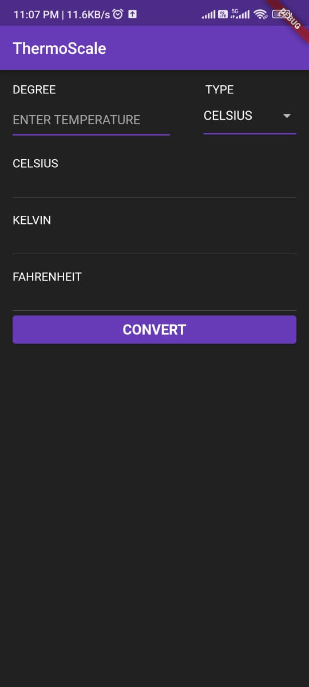
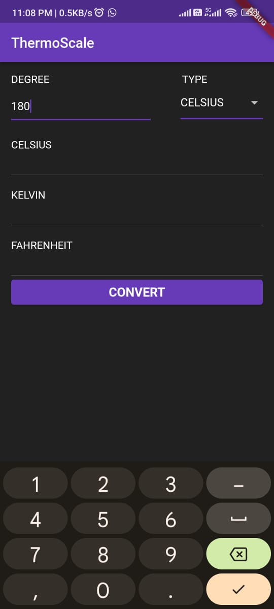
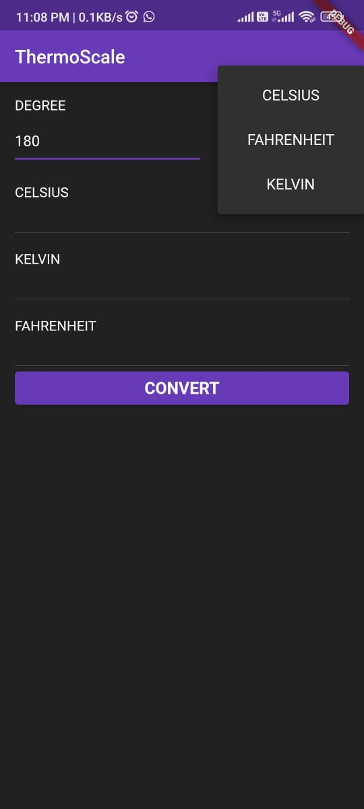
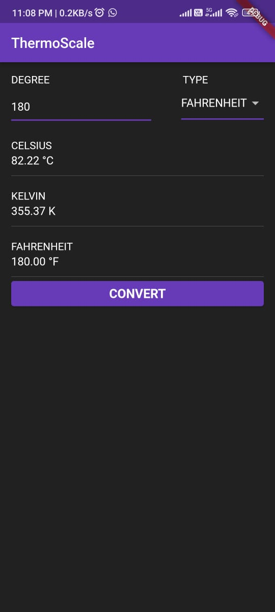

# ThermoScale

ThermoScale is a temperature conversion app built with Flutter. It allows you to convert temperatures between Celsius, Fahrenheit, and Kelvin.

## Features

- Convert temperatures between Celsius, Fahrenheit, and Kelvin.
- User-friendly interface with easy input and clear output.
- Dark theme for a pleasant viewing experience.

## Screenshots

<table style="width:100%">
  <tr>
    <td align="center">
      
    </td>
    <td align="center" style="padding-left: 40px;">
      
    </td>
  </tr>
   
  <tr>
    <td align="center">
      
    </td>
    <td align="center" style="padding-left: 40px;">
      
    </td>
  </tr>
</table>

## Getting Started

To get started with ThermoScale, follow these steps:

1. Ensure you have Flutter installed. If not, follow the official Flutter installation guide: [Flutter Installation](https://flutter.dev/docs/get-started/install)
2. Clone this repository to your local machine.
3. Open the project in your preferred IDE or editor.
4. Run the following command in the project directory to install the required dependencies:

flutter pub get

5. Connect your device or emulator.
6. Run the app using the following command:

flutter run

## Contributing

Contributions are welcome! If you encounter any issues or have suggestions for improvements, please feel free to open an issue or submit a pull request.

## License

ThermoScale is released under the [MIT License](LICENSE).
